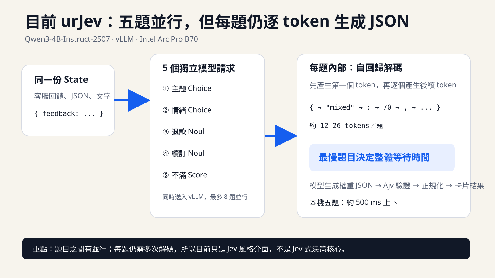
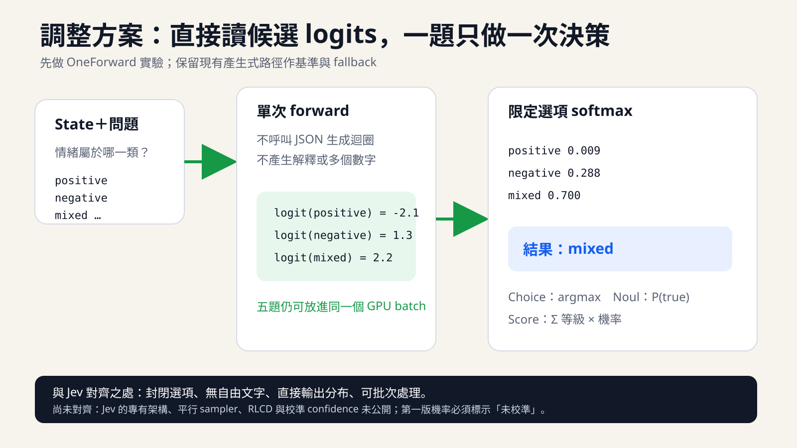

# urJev

本地結構化判斷引擎：輸入 **State（資料）** 與 **Problem（問題與規則）**，用收合卡片閱讀分類、是／否傾向與分數。

**目前主要執行方式是 Qwen3-4B-Instruct-2507＋vLLM，在 Windows 的 Ubuntu WSL2 使用 Intel GPU。這條路徑不需要啟動 Ollama。** Ollama 是保留的替代後端，請見[獨立說明](docs/ollama-alternative.md)。

本專案採 [MIT License](LICENSE)。模型權重與第三方套件遵循各自授權，未隨 repository 散布。這是 Jev 類型工作流程的原型，不是 Jev 原始模型或完整 SDK 複製品，也尚未做專屬資料微調。

## 目前設定

| 項目 | 設定 |
|---|---|
| 模型 | `Qwen/Qwen3-4B-Instruct-2507`，BF16 |
| 推論引擎 | vLLM XPU，官方預覽版 |
| 已驗證環境 | Intel Arc Pro B70 32 GB、Windows＋Ubuntu 26.04／WSL2 |
| Playground | http://127.0.0.1:15413/ |
| 模型 API | http://127.0.0.1:18000/ |
| 排程 | 非同步排程、最多八題並行、prefix cache |
| GPU 執行 | Flash Attention、decode-only XPU Graph（batch 1/2/4/8）、編譯融合的原生 RMSNorm |

這份啟動配置針對上述環境驗證。換用其他 GPU、作業系統或模型時，需要重新檢查相容性與顯存配置。

## 安裝與設定：Qwen3＋vLLM

### 1. 準備環境

Windows 端需要 Node.js 22+、PowerShell、WSL2 與適用的 Intel 顯示驅動。模型在 Ubuntu 中執行；目前 PowerShell wrapper 使用名為 `Ubuntu` 的 distribution。

Ubuntu 端需要 uv、Python 3.12，以及 `libze-intel-gpu1 libze1 libze-dev intel-opencl-icd intel-ocloc libnuma1 build-essential`。安裝系統套件時建議使用 `--no-install-recommends`，並確認適用的 GPU 世代。完整版本及曾遇到的驅動問題見[建置技術文檔](docs/urjev-intel-xpu-engineering.md)。

以下命令假設專案放在 `F:\sideproject\urJev`；若下載到其他位置，請替換路徑。

```powershell
# Windows PowerShell：專案根目錄
cd F:\sideproject\urJev
npm ci
```

```bash
# Ubuntu WSL：完成上述系統套件與 uv 安裝後
bash /mnt/f/sideproject/urJev/scripts/setup-vllm.sh
```

腳本建立 WSL 獨立 Python 環境 `~/.local/share/urjev/vllm-env`，並下載模型至 Hugging Face 標準快取。首次下載包含約 7.49 GiB 權重與數 GB 相依套件。vLLM 版本固定於腳本，其他相依項目並非完整 lockfile。

### 2. 選擇 vLLM 後端

首次建立 `.env` 時，在 Windows PowerShell 執行：

```powershell
Copy-Item .env.vllm.example .env
```

若已有 `.env`，請直接確認／調整以下欄位，避免覆寫其他設定：

```dotenv
PORT=15413
INFERENCE_BACKEND=vllm
VLLM_URL=http://127.0.0.1:18000
MODEL=Qwen/Qwen3-4B-Instruct-2507
INFERENCE_TIMEOUT_MS=120000
```

`.env` 不納入 Git。**`.env.example` 是 Ollama 替代後端範本；vLLM 請使用 `.env.vllm.example`。** 程式未指定 backend 時仍保留 Ollama fallback，所以不能省略這一步。

### 可選：切換 Qwen3-4B／8B

新增 [3×3 拼圖競賽操作文件](docs/puzzle-benchmark.md)：開啟 `/puzzle`，輸入 Jev key 後按開始，兩側從同一盤面逐步解題，記錄步數、實際延遲與完成狀態。15413 與 15414 的網頁服務均提供此頁。

若要快速重新啟動並使用所有網頁測試，請看 [HTML 測試頁面啟動與操作手冊](docs/html-test-pages-guide.md)，其中整理 Playground、100 筆 Benchmark、拼圖競賽、人工模式、JSON 匯出與常見問題。

完整的停止服務、切換、雙終端重啟、15413／15414 埠與健康檢查步驟，見 [模型切換操作紀錄](docs/qwen3-8b-evaluation.md#完整操作與驗證)。同一文件也記錄模型版本差異、情緒錯誤分析與後續驗證方案。

Arc Pro B70 32 GB 可以保留目前 4B，同時另行下載 8B。下載只做一次；切換指令只改 `.env` 的 `MODEL`，不會刪除另一個模型：

```powershell
# 下載約 16 GB 的 Qwen3-8B BF16 權重
npm run model:download:8b

# 選擇 8B；之後重新啟動 vLLM 與 urJev
npm run model:select:8b
npm run model:vllm
```

切回已保留的 4B：

```powershell
npm run model:select:4b
npm run model:vllm
```

切換前先在模型與應用服務的終端按 `Ctrl+C`。`npm run model:vllm` 會讀取 `.env` 的 `MODEL`，只允許本專案已定義的 4B 或 8B。8B 使用相同的 BF16、2 GiB KV cache、八序列上限及 XPU 最佳化設定。

已在 Arc Pro B70 32 GB／WSL 實際驗證 Qwen3-8B：模型權重約占 15.27 GiB，另配置 2 GiB KV cache，可正常載入且沒有發生 OOM。相同 100 筆、共 500 個欄位的 OneForward 測試結果如下：

| 模型 | 整體準確率 | 平均延遲 | P50 | P95 |
| --- | ---: | ---: | ---: | ---: |
| Qwen3-4B-Instruct-2507 | **78.2%** | **112 ms** | **107 ms** | **136 ms** |
| Qwen3-8B | 76.8% | 127 ms | 125 ms | 148 ms |

以上為情緒修正前的基準，安裝範本仍預設 4B。後續 8B 的四類情緒改為正負分開判斷後，同批資料整體準確率提升至 83.2%，詳見 [情緒準確度修正](docs/sentiment-accuracy-improvement.md)。原始 Qwen3-8B 預設進入 thinking mode，本專案已在推論請求明確設定 `enable_thinking: false`，避免它和 OneForward 的首 Token 候選限制衝突。原始模型比較與逐欄位結果見 [`docs/qwen3-8b-evaluation.md`](docs/qwen3-8b-evaluation.md)。

### 3. 啟動模型，再啟動 Playground

在專案根目錄開兩個 Windows 終端：

```powershell
# 終端一：持續執行模型服務，等啟動完成
npm run model:vllm
```

```powershell
# 終端二：持續執行應用服務
npm start
```

開啟 http://127.0.0.1:15413/，模型狀態應顯示 `Qwen/Qwen3-4B-Instruct-2507` 與 `vllm`。也可檢查：

```powershell
Invoke-RestMethod http://127.0.0.1:15413/api/health
```

預期為 `ready: true`、`backend: vllm`。這代表服務與模型可達，不代表答案一定正確。

## 啟動與停止

環境安裝完成後，每次只需依序執行 `npm run model:vllm` 與 `npm start`；不必重新安裝或下載，也不必執行 `model:start`／`setup:local`（那兩個命令屬於 Ollama）。

停止時，在應用服務與模型服務各自的終端按 Ctrl+C。只停止 `npm start` 不會同時停止另一個終端中的模型服務。

### 保守模式

如需切回保守的 **vLLM** 設定，先停止目前模型服務，再執行：

```powershell
npm run model:vllm:safe
```

此模式仍是 Qwen3＋vLLM，採 eager、同步排程與四序列上限。應用層送出的額外題目會在引擎排隊。兩種模式使用同一個 18000 埠，不可同時啟動；`.env` 不需變更。

本機 WSL 有 free VRAM 回報 0 與 RMSNorm 核心漏寫問題，啟動腳本保留有條件的顯存相容層、固定 2 GiB KV cache 與 native RMSNorm。這是經測試的替代路徑，不是已修復所有上游驅動問題。細節見[相容性調校歷程](docs/urjev-intel-xpu-engineering.md)。

## 在 Playground 做第一個判斷

1. **State**：填入待分析的 JSON，例如客服回饋；普通文字需包成 JSON 字串。
2. **Problem**：填入具名問題物件，直接使用 `main_topic` 等欄位，不需再包一層 `questions`。
3. 推論模式預設為 **OneForward 快速模式**；需要比較時可切換為「產生式基準」。
4. 按「執行判斷」，或使用 Ctrl／⌘＋Enter。
5. 每張卡片預設收合，右側顯示答案；點開查看規則與各選項權重。

首頁預載五題課程平台回饋範例，也可按「載入你的回饋範例」。完整資料見 [examples/feedback-systemone.json](examples/feedback-systemone.json)。支援匯出／匯入 State 與 Problem；貼上內容有 `&#x20;` 或 `\_` 造成 JSON 無效時，可按「清理貼上轉義」。

### urJev vs Jev 100 筆比較頁

開啟 `http://127.0.0.1:15413/benchmark`，可用同一份四分類 v2 資料並行比較本機 urJev OneForward 與 TypeSafe Jev 官方 API。頁面會即時顯示：

- 已完成筆數與判斷數（100 筆、每筆 5 題，共 500 個判斷）
- 累計正確率與逐筆正確數
- 最近、平均、p50、p95、總經過時間
- urJev server time 與 Jev 官方 API upstream time
- 輸入／輸出 tokens，以及可下載的逐筆 JSON 紀錄

Jev API key 只放在目前頁面的輸入欄位與每次代理請求中，不寫入檔案、localStorage、日誌或匯出結果；重新整理頁面後清除。官方請求由本機固定代理至 `https://api.typesafe.ai/v1/systemone`，用來避開瀏覽器 CORS 差異。建議從 `localhost` 開啟比較頁；若透過 Cloudflare 等公開網址使用，key 仍會經過該網址的 HTTPS 反向代理。按下比較會實際呼叫 Jev 100 次並消耗帳戶額度。模型預設為 `jev-latest`，格式依 [TypeSafe 官方 OpenAPI](https://api.typesafe.ai/docs)。

| 問題型別 | 輸入規則 | 結果 |
|---|---|---|
| `choice` | 具名 criteria 物件 | 選項與正規化權重 |
| `noul` | 是／否問題，criteria 可省略 | 「是」的 0–1 估計值 |
| `score` | criteria 為依序排列的等級陣列 | 從 0 開始的等級加權分數 |

「傾向是／否」以 60%／40% 為介面門檻。OneForward 顯示的是候選 label token logits 的限定 softmax；產生式基準則是模型文字輸出的權重正規化。兩者都尚未校準，`confidence` 為 null。**格式通過驗證不代表答案正確。**

## API 與效能明細

`POST /v1/systemone` 接受 `{state, problem}` 或 `{state, questions}`，兩種問題欄位不可並存。回傳 `answers`、`usage`、`meta`。可選 `model` 欄位僅接受 `urjev`；實際模型由伺服器 `.env` 決定。

`POST /v1/systemone/oneforward` 接受相同輸入並回傳相同 answer 型別。一般問題把每個選項轉成唯一的單 token 語意標籤；不能安全單 token 化時才使用 A–J，每個模型請求只輸出一個 label 並回傳候選 logprobs。此實驗端點每題最多 10 個選項。

**8B 情緒準確度修正（2026-09-23）：** Qwen3-8B 搭配內建四類情緒的完整指令與定義時，預設分別判斷「有沒有肯定」與「有沒有不滿」，再組合答案。因此範例的五題會送出六個單 Token 請求。自訂定義、五類情緒、其他模型以及加入範例後提示過長的情況，仍走一般路徑。`SENTIMENT_STRATEGY=direct` 可還原原路徑，修改後只需重啟網頁/API 程序，不需重載模型。方法、準確率、效能與限制見 [情緒準確度修正報告](docs/sentiment-accuracy-improvement.md)。

單次最多 16 題，choice 最多 32 選項、score 最多 10 等級；每個模型請求提示上限 7,000 UTF-8 bytes。vLLM 最多八個模型請求並行（包含情緒子問題），回應保持原問題順序。任一題失敗會等待在途工作結束再回錯誤，不回傳部分成功。

兩種推論路由共用一個 HTTP 忙碌鎖：處理中收到另一份推論請求會回 429。請求大小上限 64 KB，推論逾時由 `INFERENCE_TIMEOUT_MS` 控制。`GET /api/health` 檢查後端，`GET /api/runtime` 取得可提供的快照資訊。

效能明細預設收合，包含伺服器處理、傳輸／瀏覽器差值，以及 vLLM 排隊、排程至首 token、首至末 token 生成、平均 token 間隔及吞吐。並行題目的時間重疊，不能相加當作實際等待時間。傳輸／瀏覽器差值包含解析與排程，並非純網路 RTT。

vLLM 未提供的逐題模型載入、獨立 Prefill、記憶體配置及實際頻寬，顯示未提供，不當成零。Ollama 的計時定義不同，見[替代後端說明](docs/ollama-alternative.md)。

舊 `POST /api/decide` 分類／擷取功能仍保留為 API，不在目前 Playground 顯示；用法見[舊 API 說明](docs/legacy-api.md)。

## 產生式基準：五題並行與解碼步數

目前是「題目之間並行，每題內部逐 token 生成」。五題各自組成獨立提示與模型請求，同時送到 vLLM；應用層並行上限為八題。vLLM 將可執行的序列安排成 GPU 批次，共用同一張 GPU，並不是每題各占一張卡。超過八題時，後面的題目等前面的工作完成後再送出。

每題仍使用自回歸生成：處理輸入並產生第一個 token，再逐步產生後續 token。Token 是文字片段，不等於一個中文字；JSON 欄位、數字與標點也會占 token。「步」指解碼步驟，不是思考步驟、題數或 GPU 核心呼叫次數。

先前一筆測量中，最慢的情緒題輸出 26 tokens，所以第一個 token 之後約需 25 次解碼；輸出 100 tokens，則約需 99 次後續解碼。步數隨實際輸出改變，不固定為 25。這是目前未啟用推測解碼時的運作方式。

```text
單題耗時 ≈ 首 token 等待時間 + (輸出 token 數 − 1) × 平均解碼間隔 + 其他開銷
五題整體等待 ≈ 最晚完成題目的時間 + 應用與傳輸開銷
```

五題時間會重疊，不能把步數或生成時間直接相加。較長輸出的題目通常較慢，但提示長度與排程也會影響完成順序。例如以某次實測約 16.5 ms 的 token 間隔估算，100 tokens 的後續解碼約為 `99 × 16.5 = 1633.5 ms`，還要加上首 token 等待與其他開銷；不是固定速度保證。

### 頻寬估算與 Jev 官方速度

[Intel 官方規格](https://www.intel.com/content/www/us/en/products/sku/245797/intel-arc-pro-b70-graphics/specifications.html)列出 Arc Pro B70 的顯示記憶體頻寬為 608 GB/s。若簡化假設每次解碼讀取約 8 GB 的 BF16 權重、完全利用標稱頻寬：

```text
8 GB ÷ 608 GB/s ≈ 13.16 ms／步
25 步 × 13.16 ms ≈ 329 ms（約 330 ms）
```

**這是特定假設下的權重讀取量級估算，不是這張卡固定的物理極限，也不是完整回應時間。** 實際讀取量、快取與批次共用會影響結果；提示處理、KV cache 存取、計算、排程與傳輸等未納入。五題批次可能共用權重讀取，不能再把上式乘以五。換模型、精度、輸出長度或解碼方法都會改變估算，不能據此宣稱硬體已跑滿。

| 數字 | 定義與條件 |
|---|---|
| Jev 官方 70–500 ms | 官方公布的端到端時間；測試通常從美國西岸執行，服務也位於當地 |
| urJev OneForward p50 117 ms | 本機 24 筆五題測試的伺服器推論中位數；範圍 67–198 ms |
| urJev 約 500 ms 上下 | 本機 Qwen3-4B BF16 五題的實測量級，有波動，詳見下方紀錄 |
| 約 330 ms | 假設每步讀取 8 GB、頻寬 608 GB/s、25 次解碼的理想化權重讀取估算 |

Jev 數字來自 [2026-09-15 官方發布文章](https://typesafe.ai/blog/introducing-system-one-models-and-jev)。官方描述其模型平行產生決策；urJev 則讓多題請求並行，各題仍逐 token 輸出。兩者題目、模型、硬體與測量條件不同，不能視為同等效能或準確度。

## 最新實測與驗證

### OneForward Jev-style 實驗（2026-09-23）





相同的 Qwen3-4B BF16 與五題輸入，暖機後產生式基準實測 665 ms／94 輸出 tokens；OneForward 實測 127–167 ms／5 輸出 tokens。24 筆案例共 72 個情緒、退款、續訂判定全部符合預期；推論延遲 p50 117 ms、p95 176 ms、範圍 67–198 ms。30 項程式測試通過。這是小型 smoke set，不能代表未見資料的整體準確率。

OneForward 與 Jev 對齊的是封閉候選、沒有自由文字、直接取候選分布與批次推論；它沒有複製 Jev 未公開的模型架構、平行 sampler、RLCD 或 confidence 校準。詳細方法、限制與重跑命令見 [OneForward 實驗紀錄](docs/oneforward-experiment.md)。

後續機率校準已建立 100 筆可重現合成資料，每筆包含 State、完整 Problem 與五題標註答案，並固定分成 60／20／20 的 calibration、validation、test。實測 500 個判斷後，OneForward 準確率為 76.2%，產生式基準為 80.0%；p50 延遲為 123 ms 對 490 ms。Temperature scaling 將 OneForward test ECE 由 0.2029 降至 0.0817，但不會改變 78.0% 的 test accuracy。資料與重建方式見[資料集說明](datasets/README.md)，完整結果見[100 筆準確率與校準基準](docs/benchmarks/calibration-accuracy-2026-09-23.md)，後續方法見[校準計畫](docs/calibration-plan.md)。合成資料用來開發管線，不能單獨證明真實流量已校準。

分類邊界調整時，較長 instructions 與固定混合路由都在另一份資料上退步，因此沒有部署。保留的修改只有 unclear → 單 token unknown 語意別名：既有 500 個判斷小幅升至 76.4%，NLL 由 3.9407 降至 3.5379，p50 為 115 ms。新的 40 筆 holdout 為 88.5%、p50 119 ms；兩份合成資料差距代表準確率會隨資料分布變動。詳見[分類邊界調整與獨立 Holdout](docs/benchmarks/accuracy-boundary-tuning-2026-09-23.md)。

目前 Playground 的 sentiment 已改為 positive、negative、mixed、neutral 四類，將 unclear 併入 neutral。v2 的 100 筆資料上，OneForward 整體為 78.4%、情緒 64%；40 筆資料上整體為 90.5%、情緒 82.5%，p50 115 ms。舊五分類資料仍保留作歷史重現；設計理由、完整比較與校準結果見[情緒四分類 v2](docs/benchmarks/sentiment-four-class-v2.md)。

V2 下一輪優先處理 sentiment 的 positive／mixed 邊界、main_topic 的 other，以及 frustration 在不同資料分布下的大幅波動；noul 暫不調整。資料需求、方案順序與驗收門檻見[V2 優化路線圖](docs/v2-optimization-roadmap.md)。

加入驗證器快取後，交錯測試含準備時間的中位數由 578.4 降到 500.0 ms；實際本機 HTTP 五次測量仍為 524–611 ms，尚未穩定低於 500 ms。見[驗證器快取調校](docs/validator-cache-tuning.md)。

準確度調整後，16 筆案例的情緒／退款／續訂 48 項檢查，由 46/48 改善為首次 48/48、重跑 47/48；額外八筆案例由 20/24 改善為 22/24。25 項單元測試通過，但語意測試尚未全對。該輪五題推論測量約 461–563 ms，不含完整瀏覽器往返。詳見[準確度調整紀錄](docs/accuracy-tuning.md)。

### 先前階段的測量

先前的 0.5 秒挑戰採用正規化融合與平面具名權重輸出：交錯測試中位數 536.5 ms，十次皆未低於 500 ms；穩定性測試約 531–587 ms。**尚未達到穩定 0.5 秒以下**。完整測試、限制及回復方式見 [0.5 秒挑戰紀錄](docs/half-second-experiment.md)。以下保留上一版數據作比較。

2026-09-22，同一份五題範例、Qwen3-4B BF16：

| 測量 | 耗時 |
|---|---:|
| 重啟後第一筆測量 | 2425 ms |
| 暖機後兩次 | 744／704 ms |
| Playground 端到端 | 757 ms（伺服器 751＋額外 6） |

這是本機少量實測；初次測量可能包含暖機，其他測試也出現超過一秒的波動，不能保證每次都小於一秒。24 項程式測試、15 輪不同並行數測試、4 筆不同內容分類及 16 題上限測試通過；它們不是完整語意準確率評估，情緒題既有誤判未算成語意通過。

```powershell
npm test
node scripts/benchmark-xpu.js verification http://127.0.0.1:18000 8
node scripts/stress-xpu.js http://127.0.0.1:18000 1,4,8 xpu-verification
```

後兩個命令呼叫真實模型，產生或覆寫 `reports/` 的對應結果。已提交的實測快照在 [docs/benchmarks](docs/benchmarks)，早期非同步版本數據見 [xpu-async-production.json](docs/benchmarks/xpu-async-production.json)。

## 歷程、替代方案與限制

- [建置技術文檔](docs/urjev-intel-xpu-engineering.md)：保留 Ollama 原型、Qwen3 導入、Intel／WSL 問題定位與各階段效能比較；歷史設定不等於目前啟動設定。
- [Ollama 替代後端](docs/ollama-alternative.md)：主動選用 Qwen2.5／Ollama 時才需要的安裝與切換方式。
- [舊分類／擷取 API](docs/legacy-api.md)：相容介面與原有評測命令。

服務只綁定 localhost，尚無公開部署所需的登入、租戶隔離或用量限制。未整合 Groq／Cerebras，也沒有 LoRA／蒸餾訓練流程。專案開源不等於模型服務已公開部署。

## Cloudflare Tunnel／遠端測試

### 目前各服務的用途

| Port | 服務 | 啟動位置／外網入口 |
|---|---|---|
| `18000` | Qwen3＋vLLM 模型 | Ubuntu WSL，提供 urJev 推論 |
| `15413` | urJev 網頁與結構化 API | 本專案，`https://ai3.aischool.edu.pl/` |
| `15412` | ai2 API gateway | `first_llm_arc` 專案，`https://ai2.aischool.edu.pl/v1/systemone` |
| `15415` | 原 ARC Workspace／Qwen adapter | 只有使用 gateway 的舊 Qwen／workspace 路由時才需要；urJev 不依賴它 |

```text
ai2 → Cloudflare Tunnel → 15412 gateway → 15413 urJev → 18000 vLLM
ai3 → Cloudflare Tunnel → 15413 urJev → 18000 vLLM
```

`npm start` 只啟動 15413，不會同時啟動 gateway、模型或 Tunnel。下列是此電腦已安裝環境的手動啟動方式；重開機後需重新啟動，不能假設這些終端服務會自動恢復。若對應 port 已在監聽，不要重複啟動。

### 啟動順序：各開一個 PowerShell 終端

先確認本專案 `.env` 有以下設定（保留其他模型設定）：

```dotenv
PORT=15413
PUBLIC_ORIGIN=https://ai3.aischool.edu.pl
```

**終端一：模型服務 18000**，等待模型載入與服務啟動完成。

```powershell
cd F:\sideproject\urJev
npm run model:vllm
```

**終端二：urJev 15413**。

```powershell
cd F:\sideproject\urJev
npm start
```

**終端三：ai2 gateway 15412**。這裡使用另一專案已安裝的 Python 環境，必須切到該專案才能載入 `app.gateway`。

```powershell
cd F:\sideproject\first_llm_arc
& .\.venv\Scripts\python.exe -m uvicorn app.gateway:app --host 127.0.0.1 --port 15412
```

實際 gateway 檔案是 `F:\sideproject\first_llm_arc\app\gateway.py`。本 repository 的 [deploy/ai2-gateway.py](deploy/ai2-gateway.py) 只是部署快照，不會因 `git pull` 自動更新實際執行檔；換電腦時也需要另行準備 Python 相依套件及 gateway。

**終端四：Cloudflare Tunnel**，如果現有 Tunnel 已在執行則跳過。

```powershell
& 'C:\Program Files (x86)\cloudflared\cloudflared.exe' tunnel --no-autoupdate run --token-file 'F:\sideproject\first_llm_arc\data\cloudflare-token.txt'
```

此命令使用既有 Tunnel token 檔案，不會建立或修改 Cloudflare hostname 路由。Cloudflare 端應維持 `ai2` → `http://127.0.0.1:15412`、`ai3` → `http://127.0.0.1:15413`。Token 檔案不在 repository 中，請勿提交其內容。

### 確認服務與測試 API

```powershell
Get-NetTCPConnection -State Listen -LocalPort 18000,15413,15412 -ErrorAction SilentlyContinue
Invoke-RestMethod http://127.0.0.1:15413/api/health
Invoke-RestMethod http://127.0.0.1:15412/
Invoke-RestMethod https://ai3.aischool.edu.pl/api/health

# 外網完整五題推論測試
$jevBody = Get-Content -Raw -Encoding UTF8 F:\sideproject\urJev\examples\feedback-systemone.json
Invoke-RestMethod -Method Post -Uri https://ai2.aischool.edu.pl/v1/systemone -ContentType 'application/json; charset=utf-8' -Body ([Text.Encoding]::UTF8.GetBytes($jevBody))
```

15413 的 health 應為 `ready: true`、`backend: vllm`；15412 首頁應顯示 `urJev structured decision API`。最後的 POST 應回傳 `answers`、`usage`、`meta`。瀏覽器開啟 https://ai3.aischool.edu.pl/；Postman 使用 `POST https://ai2.aischool.edu.pl/v1/systemone`、No Auth、raw JSON Body。

### 停止與常見問題

在要停止的服務終端按 Ctrl+C。建議先停止 gateway，再停止 urJev，最後停止模型；Tunnel 若也供其他服務使用，不需隨 urJev 一起停止。停止 15413 不會自動停止 15412 或 18000。

- `address already in use`：該 port 已有服務，用上方監聽查詢確認，避免重複啟動。
- `FORBIDDEN_HOST`：確認 `PUBLIC_ORIGIN` 是正確 HTTPS 網域，修改 `.env` 後重啟 15413。
- `ready: false`：先確認 18000 模型服務已啟動完成。
- gateway 回傳 `MODEL_OFFLINE`：確認 15413 已啟動；模型未就緒也可能由 urJev 回傳此錯誤。
- 本機正常但外網失敗：確認 Tunnel 正在執行，以及 Cloudflare 路由目標 port 正確。

將 Tunnel 的 hostname 轉送到 http://127.0.0.1:15413，並在 .env 設定 PUBLIC_ORIGIN=https://你的網域，重啟 npm start。此設定只允許該確切 Host 與 Origin，不會信任任意 X-Forwarded-Host。未設定時只允許 localhost。

目前遠端測試網址為 https://ai3.aischool.edu.pl/；Postman 使用 POST https://ai3.aischool.edu.pl/v1/systemone，Content-Type: application/json，Body 同本機 State／Problem。應用目前未實作登入或 API key；允許 Host 並不等於身分驗證，公開網址可被外部呼叫。

ai2 的結構化 API 為 POST https://ai2.aischool.edu.pl/v1/systemone；與 ai3 共用目前 urJev 模型服務。路由與 gateway 快照見 [部署紀錄](deploy/README.md)。
