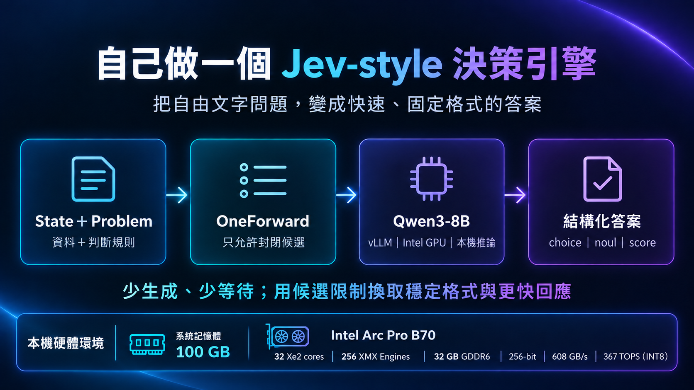
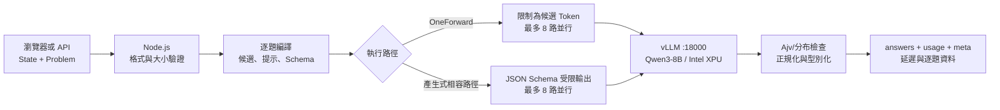

# urJev 最終軟硬體配置與處理邏輯

日期：2026-09-23。這份文件描述目前實際使用的版本，並把歷史上曾使用的 Qwen3-4B、Ollama 與舊連接埠視為替代方案或演進紀錄。執行時仍應以 `.env`、`scripts/start-vllm.sh` 與 `/api/health` 的回報為準。



核心流程只有四步：提供資料與規則、把答案限制在封閉候選、交給本機模型判斷、回傳固定格式。後續章節再說明支撐這四步的硬體與服務配置。

## 1. 系統定位

urJev 是本機的 Jev-style 結構化判斷原型。輸入由兩部分組成：

- **State**：待判斷的資料，例如客服回饋、目前拼圖盤面。
- **Problem**：題目、型別與判斷標準，支援 `choice`、`noul`、`score`。

目前快速路徑稱為 **OneForward**：每題先轉成封閉候選，限制模型只輸出一個候選 Token，再讀取候選的 logprobs 形成分布。它借鑑 Jev 的封閉式結構化決策概念，但沒有複製 Jev 的專有模型、平行 sampler、RLCD 或校準方法。

## 2. 最終硬體配置

| 層級 | 目前配置 | 用途與限制 |
|---|---|---|
| 主機 | Windows | 執行 Node.js、PowerShell 啟動器、瀏覽器與 Cloudflare Tunnel |
| 系統記憶體 | 100 GB RAM | 提供 Windows、WSL2、Node.js、vLLM 輔助資料與大型拼圖搜尋使用；與 GPU 的 32 GB VRAM 分開計算 |
| Linux 執行環境 | Ubuntu 26.04／WSL2，kernel `6.18.33.2-microsoft-standard-WSL2` | 執行 Python、PyTorch XPU 與 vLLM |
| GPU | Intel Arc Pro B70，Xe2 架構 | 32 Xe cores、256 XMX Engines、32 Ray Tracing Units；本機模型推論 |
| GPU AI／運算 | 367 TOPS（INT8）、22.94 TFLOPS（FP32） | Intel 標稱峰值；不等於本專案的實際模型吞吐量 |
| 顯示記憶體 | 32 GB GDDR6、256-bit、支援 ECC | Qwen3-8B BF16 實測約占 15.27 GiB，另固定 2 GiB KV cache；32 GB 提供載入與執行空間，不會自動提升模型準確率 |
| 顯存頻寬 | 608 GB/s（Intel 標稱） | 影響逐 Token 權重與 KV cache 搬移；完整延遲仍包含提示處理、計算、排程與應用層時間 |
| GPU 介面／功耗 | PCIe 5.0 x16、TBP 230 W | Intel 參考規格；合作夥伴卡的實際散熱與功率設定可能不同 |
| Windows 顯示驅動 | `32.0.101.8804` | 本機已驗證版本 |

上述 GPU 數值依 [Intel Arc Pro B70 官方規格](https://www.intel.com/content/www/us/en/products/sku/245797/intel-arc-pro-b70-graphics/specifications.html)整理。CPU 型號並未固定在專案設定中，因此不列為可重現規格。主要硬體限制是 Intel XPU 相容性、可用 VRAM 回報與顯存頻寬。

## 3. 最終軟體配置

| 元件 | 目前配置 | 作用 |
|---|---|---|
| Node.js | 22 或更新版本 | 網頁、HTTP API、輸入驗證、排程與結果整理 |
| Ajv | 8.17.1 | 驗證 Problem 生成的 JSON Schema 與產生式輸出 |
| Python | 3.12.14，獨立 uv 環境 | 承載 vLLM XPU 執行環境 |
| PyTorch | 2.13.0+xpu | Intel GPU 張量運算 |
| vLLM | `0.29.1rc1.dev452+g3df4ae153.xpu` | OpenAI 相容模型 API、批次排程與受限解碼 |
| Triton | triton-xpu 3.7.2 | XPU kernels 與注意力執行 |
| XPU kernels | vllm-xpu-kernels 0.1.14.1 | Intel XPU 最佳化核心 |
| Intel Compute Runtime | 26.05.37020.3 | WSL 中的 Intel GPU userspace |
| 模型 | `Qwen/Qwen3-8B`，BF16，thinking 關閉 | 目前正式本機模型 |
| 前端 | 原生 HTML／CSS／JavaScript | 不需額外前端建置流程 |

vLLM 環境位於 WSL 的 `~/.local/share/urjev/vllm-env`，模型放在 Hugging Face 標準快取。`.env.vllm.example` 仍以 4B 作為較容易首次安裝的範本；本機目前的 `.env` 已選擇 `Qwen/Qwen3-8B`。

## 4. 服務與連接埠

| Port | 服務 | 是否必要 | 說明 |
|---:|---|---|---|
| `18000` | Qwen3-8B＋vLLM | 必要 | 只綁定 `127.0.0.1`，提供 OpenAI 相容推論 API |
| `15413` | urJev Node Web／API | 必要 | `.env` 的正式預設埠，提供 `/`、`/benchmark`、`/puzzle` 與 API |
| `15414` | 同一個 urJev Node 服務 | 選用 | 常用測試埠；啟動時暫時覆寫 `PORT`，平常不需要和 15413 同時啟動 |
| `15412` | ai2 Gateway | 遠端 ai2 路徑才需要 | 位於另一個 `first_llm_arc` 專案，轉送結構化請求到 urJev |
| `15415` | 舊 ARC Workspace／Qwen adapter | urJev 不需要 | 只供舊 gateway 路由保留 |

外網路徑可採用：

```text
ai2 → Cloudflare Tunnel → 15412 Gateway → 15413 urJev → 18000 vLLM
ai3 → Cloudflare Tunnel → 15413 urJev → 18000 vLLM
```

Cloudflare Tunnel、Gateway 與 API key 都不是模型本身的一部分。urJev 預設只允許本機 Host；公開時需設定精確的 `PUBLIC_ORIGIN`，並自行補上正式環境需要的身分驗證與用量限制。

## 5. State／Problem 到答案的處理流程



### 5.1 輸入保護

1. `state` 必須是文字、物件或陣列。
2. `problem` 或 `questions` 擇一提供，每次可包含 1–16 題。
3. `choice` 需要 2–32 個選項；`score` 需要 2–10 個等級；`noul` 固定為 true／false。
4. 單題提示上限為 7,000 UTF-8 bytes，Schema 最多 6 層、80 個節點。
5. State 一律視為資料，提示明確要求模型不要把 State 內文字當成指令。

### 5.2 OneForward 快速路徑

`POST /v1/systemone/oneforward` 會把各題選項映射成單 Token 標籤，傳給 vLLM：

1. 只允許候選 Token，`max_tokens=1`，並關閉 Qwen3 thinking。
2. 讀取所有候選標籤的 logprobs。
3. 將候選分數正規化後映射回原始答案 key。
4. 最多同時執行 8 個推論工作，回傳順序仍依原 Problem 排列。
5. 任一工作失敗時，等待已在途工作結束後再回錯誤，避免請求鎖提早釋放。

輸出型別化規則：

- `choice`：選擇最高分的 key，並回傳各選項分布。
- `noul`：回傳 true 的分數，0 趨近否、1 趨近是。
- `score`：用各等級分布計算從 0 開始的加權平均。

候選分布目前 **尚未完成真實資料校準**，所以 API 保留 `calibrated: false` 與 `confidence: null`；分數不能直接解讀為實際正確率。

### 5.3 情緒題的專用拆解

當模型是 Qwen3-8B、策略為 `auto`，而 Problem 完全符合內建四類情緒定義時，情緒不直接做四選一，而是並行判斷：

| 明確肯定 | 明確不滿 | 情緒結果 |
|---|---|---|
| 是 | 否 | positive |
| 否 | 是 | negative |
| 是 | 是 | mixed |
| 否 | 否 | neutral |

兩個子題都只輸出 true／false Token，並用少量示範區分「退款或取消行為」與「明確不滿」，也避免把禮貌性「謝謝」誤判為肯定。五題範例因此會產生六個推論請求，但仍只有五個最終 answers。

這項拆題只套用在精確匹配的內建定義；自訂情緒標準、五分類或過長提示會回到一般單標籤路徑。

## 6. vLLM 與 Intel XPU 執行設定

目前 `scripts/start-vllm.sh` 的關鍵設定如下：

- BF16，最大 context 8192 tokens。
- `max-num-seqs=8`，與應用層最多八路並行對齊。
- 固定 2 GiB KV cache；`gpu-memory-utilization=0.65` 不等於實際硬上限。
- 啟用 async scheduling、prefix cache、Flash Attention。
- 啟用 decode-only XPU Graph，預錄 batch 1／2／4／8。
- `rms_norm` 與 `fused_add_rms_norm` 強制走 native 實作，避開本機曾重現的 XPU 核心漏寫問題。
- 使用自訂 WSL worker 處理可用 VRAM 回報為 0、pinned memory 與 UVA 相容問題。
- 關閉 vLLM、Hugging Face 的使用統計與遙測。

這些設定是針對目前 Intel Arc Pro B70／WSL 環境驗證的組合，不應直接視為所有 Intel GPU 的通用最佳值。

## 7. 三個測試頁面的邏輯

### Playground `/`

用來手動輸入 State 與 Problem，查看結構化卡片、逐題分布、伺服器時間、額外傳輸時間與完整 JSON。適合規則設計和單筆除錯。

### Benchmark `/benchmark`

用固定 100 筆資料、共 500 個標註欄位測試 urJev，也可輸入 Jev API key 讓兩邊同時執行。頁面會保存每筆答案、是否正確、延遲與 token 資訊，支援逐題分析、篩選、複製與下載 JSON。Jev key 只留在當前頁面記憶體。

目前 Qwen3-8B 加上情緒拆題，在 100 筆 v2 合成資料得到 416/500（83.2%）；五題平均評估時間 143.12 ms、P50 138 ms、P95 178 ms。這是本機評估函式範圍，不包含外網傳輸，也不能代表真實業務資料的保證準確率。

### Puzzle `/puzzle`

盤面由合法移動從完成狀態打亂，所以一定可達；目標是由左到右、由上到下排列，空格 0 在右下角。支援 3×3 到 10×10。

| 模式 | LLM 是否參與 | 邏輯 |
|---|---|---|
| 純模型 | 每步呼叫 | 模型從合法方向選下一步；最能觀察模型規劃能力，也最容易循環 |
| 模型＋規劃建議 | 每步呼叫 | 搜尋器提供建議，模型保留決定權 |
| 強制規劃路徑＋模型驗證 | 每步呼叫 | 搜尋器決定動作，模型仍被呼叫作驗證並計入延遲 |
| 本機規劃器基準 | 不呼叫 | 只量本機搜尋速度，不能拿來代表模型速度 |

規劃器對 3×3、4×4 採 BFS，最多保留約 200,000 個已訪問盤面；5×5 到 10×10 採有限 Beam Search，深度 20、每層最多 512 個候選。評分同時考慮曼哈頓距離與由左上開始的連續歸位前綴，並避開本局全局已訪問盤面。執行器若連續三步都進入重複盤面便停止，避免無限循環。

有限搜尋提高成功率，但不保證大盤面或較深打亂都能解出。提高深度與候選數會增加 CPU、記憶體與每步等待時間。

## 8. 啟動與確認

在專案根目錄開兩個 PowerShell 終端：

```powershell
# 終端一：Qwen3-8B／vLLM，埠 18000
npm run model:vllm

# 終端二：urJev 網頁與 API，預設埠 15413
npm start
```

若只想在 15414 測試：

```powershell
$env:PORT = '15414'
npm start
```

確認目前實際狀態：

```powershell
Invoke-RestMethod http://127.0.0.1:18000/v1/models
Invoke-RestMethod http://127.0.0.1:15413/api/health
```

health 應回報 `ready: true`、`backend: vllm`、`model: Qwen/Qwen3-8B`。若顯示 4B，代表 `.env` 或已啟動的 vLLM 程序尚未切換；修改 `.env` 後必須重啟模型與 Node 服務。

## 9. 驗證、資料與界限

- 自動測試涵蓋輸入驗證、候選分布、情緒拆題、並行限制、失敗處理、HTTP 路由與拼圖核心。
- Benchmark 的 100／40／32 筆資料主要是合成資料；已用來找錯與比較版本，不能再視為盲測。
- 真正提高準確率的下一步是收集真實、人工覆核、與提示調整隔離的資料，再獨立做 calibration／validation／test。
- JSON Schema 和封閉候選能保證格式與合法答案，不能保證語意一定正確。
- 8B 比 4B 有更大容量，但是否改善取決於模型版本、提示、任務邊界與解碼方式；本專案的提升主要來自情緒拆題與示範，而不是只把模型放大。
- 對外公開 15413 或 15412 前需要另加認證、速率限制、日誌與秘密管理；目前的 Host allowlist 不是完整安全邊界。

## 10. 主要檔案

| 檔案 | 職責 |
|---|---|
| `src/server.js` | HTTP 路由、Host／Origin、busy lock、錯誤與 Server-Timing |
| `src/engine.js` | vLLM／Ollama 介接、OneForward 候選 Token、logprobs 與模型 health |
| `src/systemone.js` | Problem 編譯、Ajv validator cache、並行工作與答案型別化 |
| `src/sentiment.js` | 四類情緒的肯定／不滿拆題與分數組合 |
| `public/app.js` | Playground 畫面與結構化結果卡片 |
| `public/benchmark.js` | 100 筆比較、逐題分析與 JSON 匯出 |
| `public/puzzle-core.js` | 拼圖狀態、合法移動、搜尋與循環保護 |
| `public/puzzle.js` | urJev／Jev／人工拼圖操作與計時 |
| `scripts/start-vllm.sh` | Intel XPU 正式啟動參數 |
| `scripts/urjev_compiled_worker.py` | Intel／WSL 顯存與執行相容層 |

更完整的安裝故障、效能演進與原始證據見[Intel XPU 建置紀錄](urjev-intel-xpu-engineering.md)、[Qwen3-8B 實測](qwen3-8b-evaluation.md)、[情緒準確度修正](sentiment-accuracy-improvement.md)與[測試頁操作手冊](html-test-pages-guide.md)。
